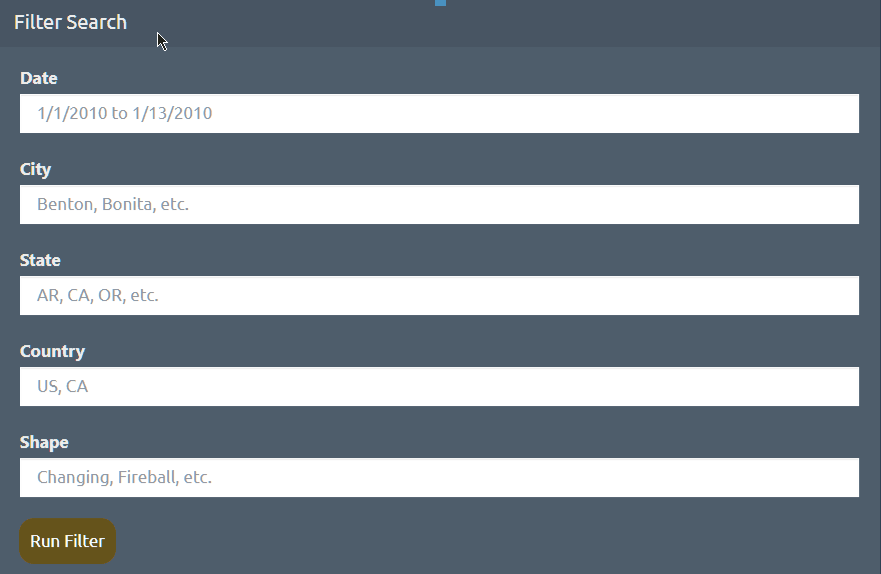
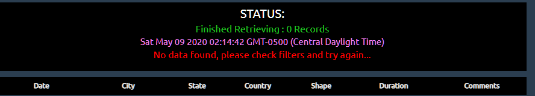
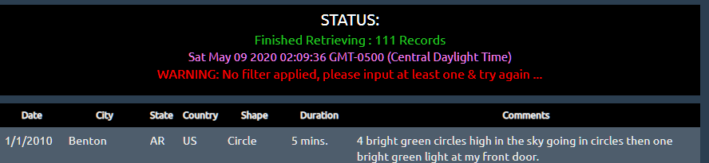
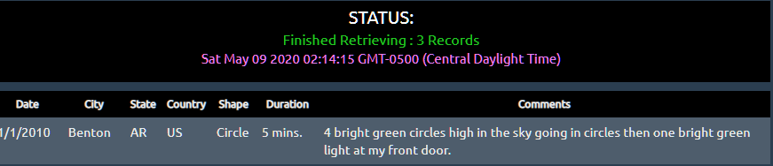

# ::: Area 51: Home of Flying Saucers? Where else? :::
## Background
In this project, a JavaScript array of **111** objects were used to construct a web-based app to help users quickly query the data about UFO based on different input conditions and return a data table. This table size (rows x columns) is changed dynamically based on how much data is retrieved.

There are two different "levels" built for this project:  
* Lev-1 consists of a simple "*Date*" filter input. <a href="https://henryle-n.github.io/JavaScript-Challenge/UFO-level-1/">**Click here**</a> for UFO webpage level-1 demo
* Lev-2 consists of multiple filtering inputs, such as: "*Date*", "*City*", "*State*", "*Country*", "*Shape*" that allows user to further "tune-up" the query. <a href="https://henryle-n.github.io/JavaScript-Challenge/UFO-level-2/">**Click here**</a> for UFO webpage level-2 demo

<link rel="stylesheet" type="text/css" media="all" href="https://github.com/henryle-n/JavaScript-Challenge/blob/master/UFO-level-1/static/css/readmecss.css"/>

---

  

---
## Tools/ Techniques/ Technologies
* HTML-5 | CSS-3 | JavaScript/ ECMAScript-5 | D3.js | Bootstrap-4 | DOM | Markdown
* Visual Studio Code Insiders | Live Server (*by R. Dey*) | Instant Markdown (*by D. Bankier*) | Google Chrome ver. 84x
* MacOS Mojave | Windows 10 Pro, ver. 1909 OS Build 18363.778

## Table of Contents
The main directory consists of 3 folders:
* **InDev** :: files for future development
* **UFO-level-1** :: contains apps and scripts of single filter (by '*Date*')
* **UFO-level-1** :: contains apps and scripts of multiple filters

Both Level-1 and Level-2 parts consists of same folders & files, as the following:  
* **static** 
    * **css** :: style sheet for webpage formating 
    * **images** :: images shown on webpage and `README.md`
    * **js** :: JavaScript to drive filters and make table from filtered array, & the original array of 111 objects
*  **index.html** :: webpage construction HTML codes 

## General Workflow
Both levels consist of the same workflow: 
* Retrieve user input(s) from front-end HTML by using D3 / HTML DOM
* Pass query condition(s) into back-end JS functions and processes
* Filter out relevant data and build table of filtered objects

**NOTE:** unlike level-1, level-2 has more sophisticated back-end program to dynamically build an object of user defined filtering conditions and pass them into the second argument of the **`Array.filter(callback, contextObject)`** function everytime user submits new inputs. This will ensure data is retrieved effectively without the need of refreshing webpage

<a href="https://www.javascripttutorial.net/javascript-array-filter/">**Click here**</a> for detailed explaination of **`filter`** and **`callback`** functions 

## Other features
Besides multi-filters, there are also other features to enhance UX/UI:
* "**HINT**" box appears when user hovers mouse over the input box

 

* Data Retrieval `STATUS` Box to inform user:
    * If data was found, or not found, or needs user input
    * Show how many records match user's query conditions
    * What time the data was retrieved

  

    
  

  

    
  

  

    
  

## Summary
* D3, DOM & JavaScript introduce a whole new level of dynamic webpage and enhance interactive capability
* Thanks to these back-end drivers, data is filtered correctly based on user input(s). The summary table is then dynamically built and its size adapts to the amount of returned data
* By passing the 2nd argument into the **`Array.filter()`** function and using **`this`** keyword, the webpage now unlocks unlimited filtering scenarios/ results for user as the filters changed in real-time  based on user input
